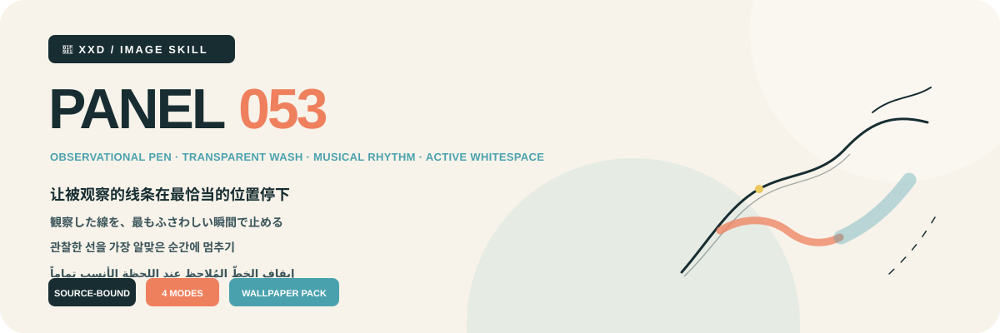
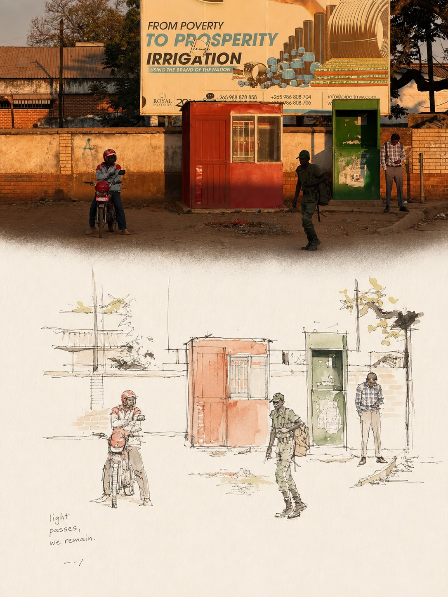
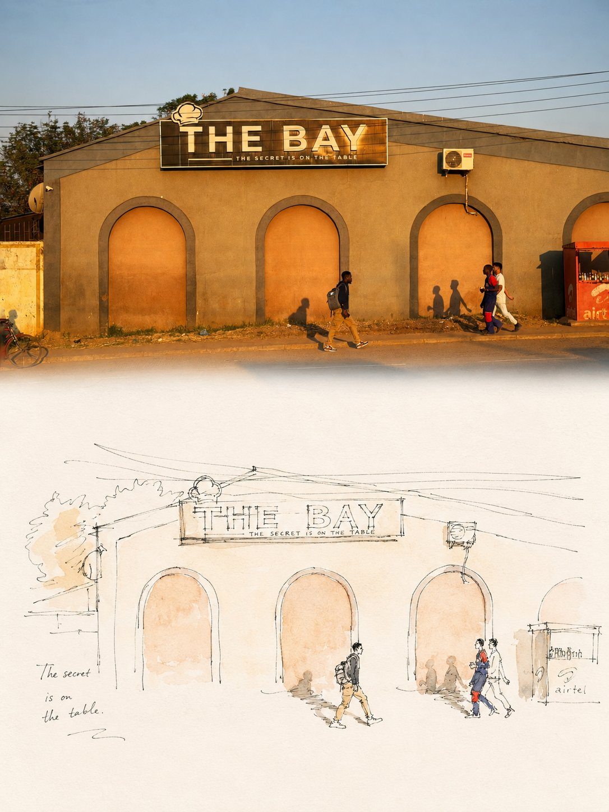
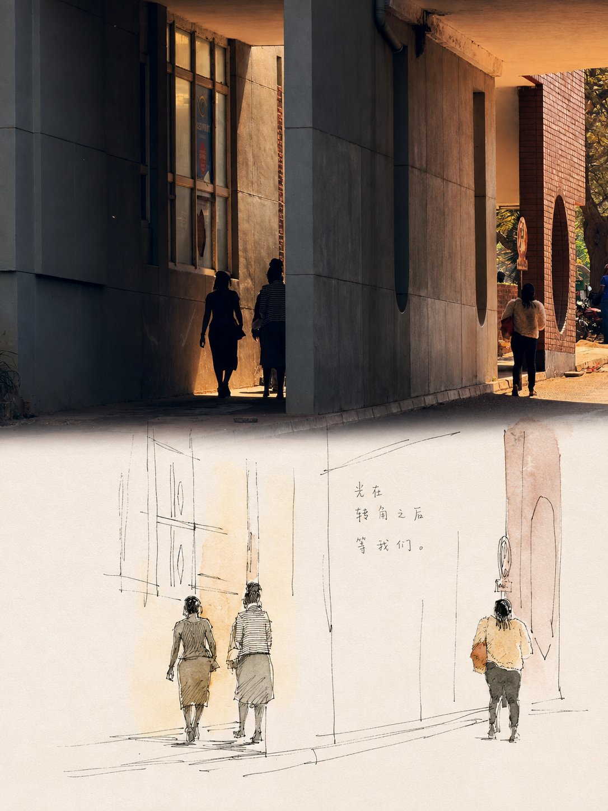
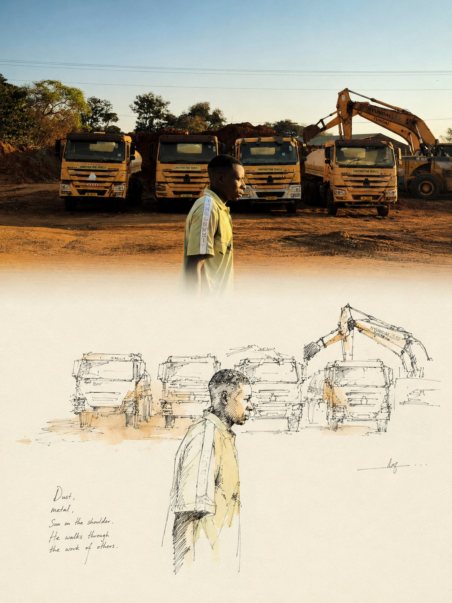

<p align="center"></p>

<div align="center" dir="rtl">

# 🦁 XXD Panel 053

### إيقاف الخطّ المُلاحظ عند اللحظة الأنسب تماماً

[](./SKILL.md)
[](#)
[](#)

<a href="README.md">简体中文</a> خط قلم ملاحظ · تلوين شفاف · إيقاع موسيقي · ورق شبه أبيض · فراغ فعّال

تُختزل الصورة إلى أقل عدد من الخطوط وملاحظات اللون الشفافة التي تحفظ هويتها. ويصبح أقوى محيط أو فعل لازمة بصرية تُنظّم بالتكرار والتنويع والنبرة والوقفة والتوقف الحاسم.

## لماذا توجد هذه المهارة؟

يعتمد الأسلوب على المصدر وليس قالباً زخرفياً يمكن تبديل محتواه. ويتبع سلسلة التحويل الآتية:

```text
lock identity, proportion, posture, direction, and relation → preserve three cues → select lines worth remembering → establish one visual motif → repeat, vary, accent, pause, and stop → add two to four source-derived washes → let near-white paper act as silence → let copy become a light echo
```

إذا أمكن استبدال المصدر بصورة لا صلة لها من دون تغيير جوهري في اللازمة وعلامات التعرّف وإيقاع الخط وملاحظات اللون والفراغ والنص، فالنتيجة لا تنتمي إلى هذا Panel.

## العقد البصري

- تُحفظ ثلاث علامات خاصة بالمصدر على الأقل من المحيط والنسبة والوضع والفعل والاتجاه والبنية والعلاقة.
- تُستخدم خطوط قلم رفيعة وحرة وغير متساوية مع خطوط البحث والتصحيح والثقل المفاجئ والحواف غير المكتملة مع دقة النسب الأساسية.
- يتحول محيط أو فعل واحد إلى لازمة من التكرار والتنويع والنبرة والوقفة، ويعمل الفراغ الكبير كصمت مقصود.
- تُستخدم من لونين إلى أربعة ألوان مصدرية كتلوين موضعي شفاف، ويُضبط الورق شبه الأبيض وفق حرارة المصدر.
- «الانتقال الطبيعي» استمرارية بصرية قرب خط المنتصف الثابت، ولا يغيّر هندسة 50/50 الدقيقة في النمط المزدوج.

توجد القيود الجمالية وقواعد الرفض الكاملة في المهارة وتوجيهات الإنتاج. وهي تحفظ دافع النص الأصلي من دون تحويل لوحة 3:4 التاريخية إلى قيمة افتراضية خفية. [SKILL.md](SKILL.md) · [production prompt](references/xxd-panel-053-prompt.en.md)

## النماذج · من X

> [Xiaoxiaodong (@xiaoxiaodong01)](https://x.com/xiaoxiaodong01/status/2091521812878459186) · 23 أغسطس 2026<br>
> GPT2 × رسم يدوي × ارتجال × توجيه جمالي × VOL.053

<table>
  <tr>
    <td width="50%"><a href="https://x.com/xiaoxiaodong01/status/2091521812878459186"></a></td>
    <td width="50%"><a href="https://x.com/xiaoxiaodong01/status/2091521812878459186"></a></td>
  </tr>
  <tr>
    <td width="50%"><a href="https://x.com/xiaoxiaodong01/status/2091521812878459186"></a></td>
    <td width="50%"><a href="https://x.com/xiaoxiaodong01/status/2091521812878459186"></a></td>
  </tr>
</table>

<p align="center"><a href="https://x.com/xiaoxiaodong01/status/2091521812878459186">عرض المنشور الأصلي والتوجيه كاملاً ←</a></p>

تعرض هذه النماذج الدافع الجمالي للإصدار 053 فقط؛ ولا تصبح موضوعاتها أو تكوينها أو ألوانها أو نصوصها أو نسبة اللوحة السابقة مراجع للتوليد أو إعدادات افتراضية حالية.

## أربعة مخرجات قابلة للجمع

يمكن اختيار نمط واحد أو عدة أنماط بـ `1` أو `1+3` أو `1,2,4` أو `الكل`؛ وينتج «الكل» سبعة ملفات PNG مستقلة لكل مصدر. بعد اختيار النمط وقبل التوليد، تُحسم نسبة لوحة الناتج كاملة: `3:4` الخاصة بالتوجيه الأصلي، أو نسبة المصدر باختيار صريح، أو نسبة شائعة، أو نسبة／بكسلات مخصصة. لا تُطبّق أبعاد المصدر ضمنياً.

| النمط | قاعدة اللوحة | الناتج |
| --- | --- | --- |
| `top-bottom` | لوحة نهائية أكدها المستخدم | توليد كامل واحد: المصدر عالي الوفاء في الأعلى وتصميم 053 في الأسفل، نحو 50/50 |
| `left-right` | لوحة نهائية أكدها المستخدم | توليد كامل واحد: المصدر عالي الوفاء يساراً وتصميم 053 يميناً، نحو 50/50 |
| `design-only` | لوحة نهائية أكدها المستخدم | يملأ تصميم 053 اللوحة ولا تظهر صورة المصدر |
| `wallpaper-pack` | تأكيد مستقل لكل جهاز | ملفات PNG منفصلة للهاتف وiPad والحاسوب وساعة الأطفال |

تستخدم الأنماط الثنائية المصدر كمدخل تحرير／مرجع عالي الوفاء، وتولّد التكوين النهائي مباشرة بتوجيه الأسلوب الكامل كي تتماسك الصورة والتصميم واللون والضوء والكتابة والمعنى. ولا يُستخدم التركيب الحتمي إلا بعد فشل إعادة محاولة محددة للوحة الكاملة، أو عند طلب حفظ المصدر بكسلاً ببكسل، أو عجز مسار التوليد عن تحقيق اللوحة، أو للحاجة إلى معايرة نهائية بلا فقد.

يمكن أن تكون الخلفيات مترابطة أو مستقلة. تعتمد المترابطة عملاً مرجعياً واحداً لـ iPad ثم تعيد تكوين كل جهاز من الأصل والمرجع نفسه. أما المستقلة فيرجع كل جهاز فيها إلى الأصل وحده. ولا يقص أي منهما ناتج جهاز آخر ولا يسلسل المشتقات.

## النص واللغة

يُحسم قبل التوليد النص التلقائي أو النص الدقيق المخصص أو غياب النص. تتبع اللغة الجمهور المقصود لا لغة الأمر، ويبقى نص المستخدم النهائي حرفياً.

قاعدة النص الخاصة بالمشروع: يُستخلص فقط لفظ أو عبارة قصيرة أو علامة أو عنوان بالغ القصر مرتبط بالموضوع أو الفعل أو البيئة أو الصوت أو الزمن أو الذاكرة أو تفصيل عابر، ويوضع كنبرة أو وقفة أو صدى خفيف على محيط أو نظرة أو مسار حركة أو حافة غير مكتملة.

## أولوية اللوحة الكاملة وحدود الصورة النقطية

يتولى نموذج الصور إعادة البناء الجمالي للعمل النهائي كله، وتستخدم التركيبات الثنائية أيضاً توليد لوحة كاملة واحدة افتراضياً. ولا يبقى `scripts/compose_panel.py` إلا للاسترداد المشروط ومعايرة البكسلات بلا فقد والتدقيق للقراءة فقط؛ فلا يعمل مسبقاً ولا يحكم على النجاح الجمالي.

كل التسليمات ملفات PNG نقطية، وينشئ كل استدعاء مهمة جديدة تحت `~/Desktop/xxd/`. ولا يكشف مسار الصور المضبوط سوى حالة منزوعة التفاصيل، من دون المزوّد أو نقطة الاتصال أو بيانات الاعتماد أو الرؤوس أو التوجيهات أو الاستجابات أو معلومات الحساب. ولا تصلح SVG أو HTML أو Canvas أو الرسوم البرمجية بديلاً للعمل النهائي.

## أولوية نموذج الصور

يظل GPT Image 2 الخيار الأول افتراضياً، مع الحفاظ على سير العمل الحالي: مرجع المصدر عالي الوفاء، وحسم اللوحة النهائية قبل التوليد، وتوليد اللوحة الثنائية كاملة في عملية واحدة، وعدم استخدام التركيب البرمجي إلا كحل احتياطي مشروط.

يمكن أيضاً استخدام Seedance 5.0 Pro أو Nano Banana Pro (Gemini Image Pro) أو Nano Banana 2 (Gemini Image Flash) أو نموذج نقطي متوافق آخر عندما يكون متاحاً فعلاً عبر الأدوات الحالية أو المسارات المضبوطة، وقادراً على تلبية وفاء المصدر ونسبة اللوحة النهائية ونص اللغة المستهدفة والمراجع المتعددة للخلفيات المترابطة. يغيّر النموذج البديل مسار التوليد فقط، ولا يغيّر الأنماط أو اللوحة أو النص أو اللغة أو علاقة الخلفيات أو أولوية اللوحة الكاملة.

إذا لم يوجد مسار مناسب، تطلب المهارة من المستخدم تفعيل أداة لتوليد الصور أو تقديم API Key. يمكن استخدام بيانات الاعتماد التي يقدمها المستخدم للمهمة الحالية من دون تكرارها أو عرضها أو تسجيلها أو كشفها. ولا تُحفظ طويلاً ولا تتغير إعدادات المزوّد أو الحساب أو الفوترة أو المسار العام إلا بطلب صريح من المستخدم.

## البدء

```bash
git clone https://github.com/nevertoday/xxd-panel-053.git
mkdir -p ~/.codex/skills
ln -s "$(pwd)/xxd-panel-053" ~/.codex/skills/xxd-panel-053
```

يمكن لمستخدمي Claude Code ربط المجلد نفسه بالمسار: `~/.claude/skills/xxd-panel-053`. أعد تشغيل جلسة الوكيل بعد التثبيت.

```text
$xxd-panel-053
Use this photograph, ask me for the modes and copy setting, then generate fresh raster outputs.
```

المواصفات الكاملة: [مسار عمل المهارة](SKILL.md) · [أرشيف الأسلوب الأصلي](references/053-source.md) · [توجيه الإنتاج الإنجليزي](references/xxd-panel-053-prompt.en.md) · [توجيه الإنتاج الصيني](references/xxd-panel-053-prompt.zh-CN.md)

## عن XXD

XXD هو اختصار اسم علامة Xiaoxiaodong. أنشأ المشروع ويديره: [@xiaoxiaodong01](https://x.com/xiaoxiaodong01).

## الدعم والعضوية

### استشارة متعمقة · 299 يواناً/ساعة

استشارة فردية متعمقة في استخدام Skills ومسار العمل. تواصل مع Xiaoxiaodong عبر WeChat. [WeChat](https://xiaoxiaodong.pages.dev/assets/wechat-qr.png)

### مجموعة مستخدمي Xiaoxiaodong Skills · 99 يواناً

تتيح دفعة واحدة الانضمام إلى مجموعة مستخدمي Skills لتبادل المسارات والنقاش؛ والاستشارة الفردية بالساعة منفصلة.

### Knowledge Planet＋مكتبة توجيهات الأعضاء · 699 يواناً/سنة

Knowledge Planet ومكتبة توجيهات الأعضاء عضوية سنوية واحدة. اشترك عبر أي منهما ثم تواصل عبر WeChat لفتح الخدمة الأخرى.

[Knowledge Planet](https://wx.zsxq.com/group/15554814142882) · [Member Prompt Library](https://vip.xiaoxiaodong.ai/)

<p align="center"><a href="https://xiaoxiaodong.pages.dev/assets/wechat-qr.png"></a></p>

<div align="center" dir="rtl"><strong>لا تُكمل رسم الصورة؛ توقّف عند اللحظة الأنسب.</strong></div>

---

<div align="center" dir="rtl">

## ☕ دعم المشروع المفتوح المصدر

تستخدم النسخ غير الصينية Buy Me a Coffee. الدعم اختياري ولا يغيّر الوصول إلى المشروع المفتوح المصدر.


<p align="center"><a href="https://github.com/nevertoday/zhongguo-traditional-colors/blob/main/docs/images/buy-me-a-coffee-qr.png?raw=true"></a></p>

</div>
</div>
